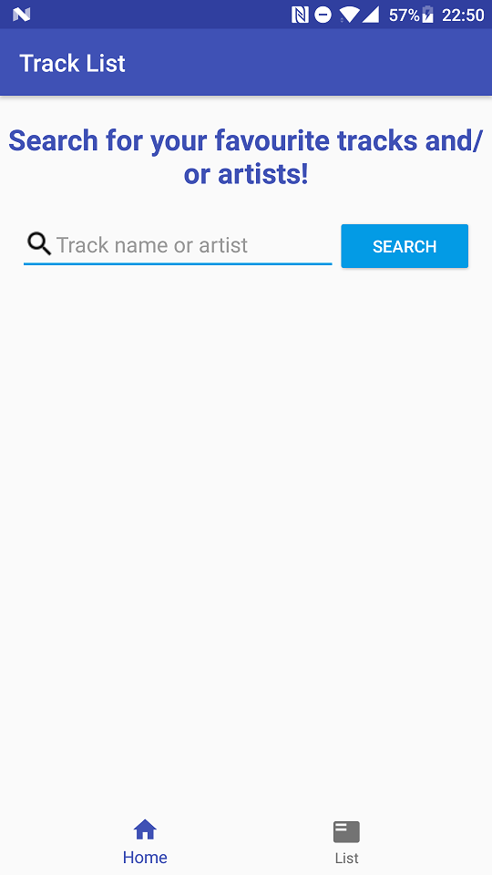
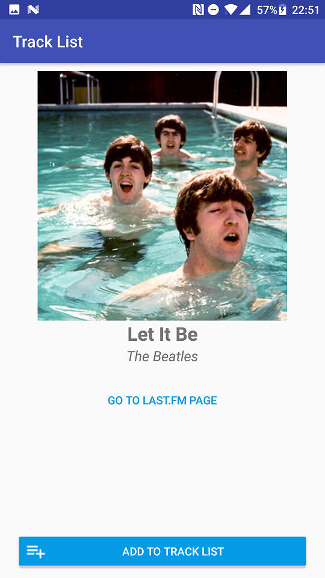
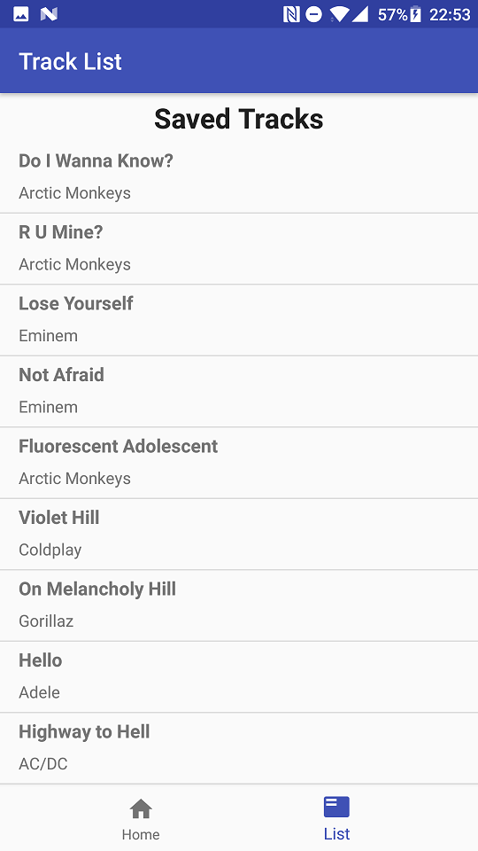

# TrackList

Native App Studio - Project 3

By Sebastiaan Joustra

A simple app that allows the user to search for songs (by using the Last.FM API) and add them to a 'listen list'.
From the list, the user can view information about the track.

## How to run

Open in Android Studio and run on a Android device with 7.0 or higher.

### Screenshots

